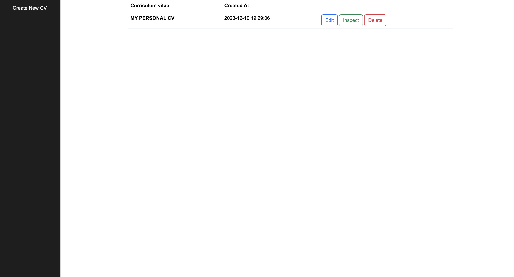
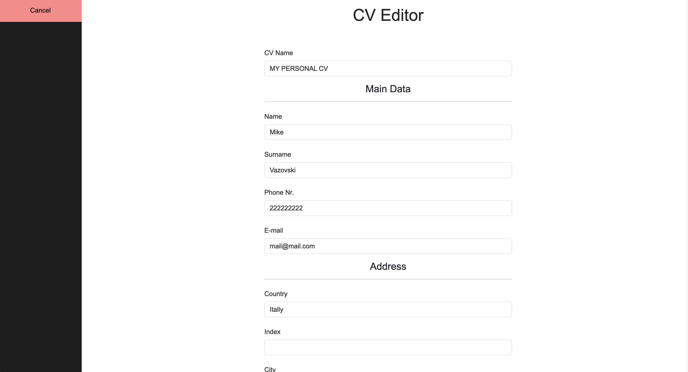
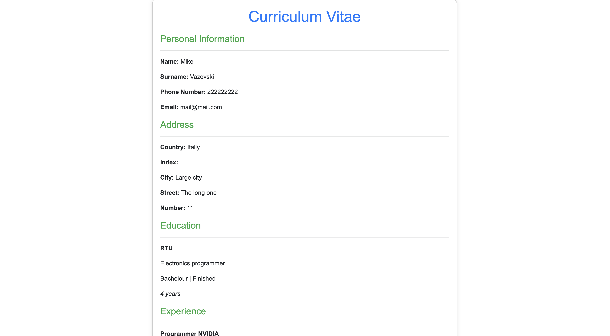
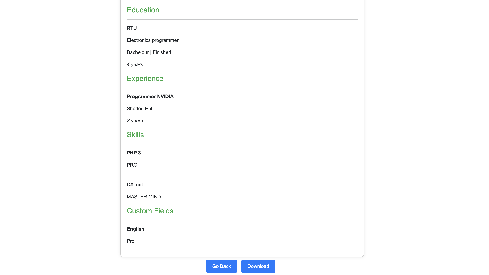

<h2>Setup</h2>

``1. composer install --ignore-platform-reqs``

``2. create .env from .env.example and update with DB data``

``3. import data and tables from Cv-Editor/migrations folder``

``4. php -S localhost:8000``

 

<h2>Main View</h2>

<h2>CV Editor</h2>

<h2>Inspector/Print View</h2>

